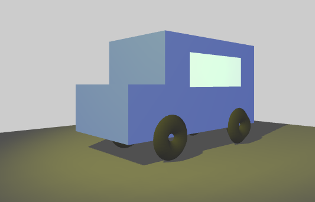

##WebGL No.2 - 光和影

###效果图

###demo
[demo](http://teresaruan.github.io/ife/WebVR/charpt2/index.html)

### 任务思考
#### 1.灯光的位置对哪些类型的灯光是无所谓的，以及为什么？

**环境光**，原因：环境光在各处行程的亮度是一致的，主要是用来为场景指定一个基础亮度。  

#### 2.一个物体如何将阴影投射到自身？

  
	[Mesh].reciveShadow = true;  
	[Mesh].castShadow = true;

#### 3.实现软阴影的效果（即阴影的边缘有明暗的渐变）？

	
	 [renderer].shadowMapSoft = true;
	//看到网上有如下这种写法，比较后发现效果一致
     [renderer].shadowMap.type = THREE.PCFSoftShadowMap;

### 笔记  
**点光源**：不计光源大小，点光源照到不同物体表面的亮度是线性递减的，离光源越远的物体会显得越暗，在三维软件中，点光源就是一个灯泡的造型。  

	THREE.PointLight(
	hex,intensity[缺省时为1，亮度],
	distance[官员最远照射到的距离，缺省为0]
	)

调整点光源位置可明显感觉到光的渐渐变得微弱

**平行光**：太阳光就是典型的平行光，光的亮度不会随距离而减弱。设置位置尤为重要。  

	THREE.DirectLight(hex,intensity)

**聚光灯**：和生活中的聚光灯表现效果一致

	THREE.SpotLight(
	hex,
	intensity,
	ditance,
	angle[聚光灯张角，缺省为Math.PI/3,最大Math.PI/2],
	penumbra[聚光锥半影衰减百分比，0 1之间，默认0]，
	decay[沿着光照距离的衰减量，2实现现实中的效果缺省-1],
	shadow[此属性存储用来渲染光照阴影的所有相关信息],
	castShadow[true为投射动态阴影，默认为false]
	)
聚光灯需要设置target,可以是`light.target.position.set()` 或 `light.target = [object]`

>能形成阴影的光源只有`THREE.DirectionalLight`和`THREE.SpotLight`;相对的能表现阴影效果的材质只有`THREE.LamberMaterial`和`THREE.PhongMaterial`  

### 表现阴影的材质  

	THREE.MeshLambertMaterial() //漫反射
	THREE.PhongMaterial（） //镜面反射
	