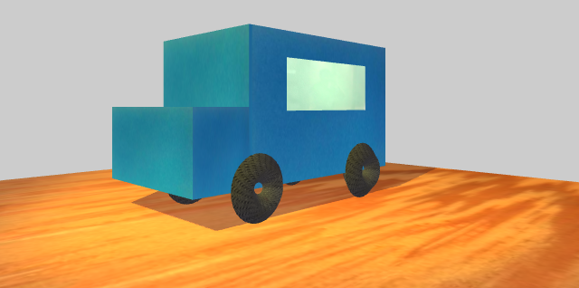

##WebGL No.2 - 光和影

###效果图

###demo
[http://teresaruan.github.io/ife/WebVR/charpt3/index.html](http://teresaruan.github.io/ife/WebVR/charpt3/index.html)

###笔记 
####1.材质类型  
**基本材质 BasicMaterial**

渲染后的物体颜色始终是该材质的颜色，不能表现光照效果。没有指定材质颜色，颜色每次渲染的时候都会随机。

常见属性：  
wireframe： 渲染为线框。默认false  
color： 十六进制颜色。缺省为0xffffff  
map： 设置纹理贴图。缺省为null 
fog： 定义材质颜色是否受全局雾设置的影响。默认false

**Lambert材质 MeshLambertMaterial**  
一种非发光材料的表面，主要用来表现漫反射的物体表面。能表现光照和阴影。

>光照模型公式`Idiffuse = Kd * Id * cos(theta)`，`Idiffuse`漫反射光强度，`kd`材质表面的漫反射洗漱，`Id`光强，`theta`光的入射角弧度

常见属性：  
emissive：设置放射光颜色。默认是0x000000。基本上是一个不受其他光照颜色影响的颜色。
ambient： 表现对环境光的反射能力，只有当设置了AmbientLight后该值才有效

**Phong材质 MeshPhongMaterial**  
用于表面有光泽的材料。 能表现光照和阴影。
>光照模型公式`Ispecular = Ks * Is * (cos(alpha)) ^ n`，`Ispecular`镜面反射光强度，`ks`材质表面镜面反射系数，`Is`光源强度，`alpha`反射光和视线的夹角，`n`高光指数，越大高光光斑越小
  

>注意：必须指定specular参数，才会有镜面反射的效果，其为一个颜色值  

常见属性：  
specular： 设置高亮颜色，缺省为0x111111  
shinines： 设置亮度,原先的版本是数值越大越暗，查阅文档后现在是相反的（调整后没有太明显的感觉，继续尝试中）  
emissive： 同上。材质自发光，可以用来表现光源颜色。  
emissiveIntensity： 放射光强度，调节发光颜色。默认为1.  
reflectivity： 反射率，默认为1.  

**法向材质 MeshNormalMaterial**  
法向材质，可以将材质的颜色设置为其法向量的方向，用于调试很方便。

**基础线条材质 LineBasicMaterial**

绘制线框式结构的材质  

常见属性：  
linewidth：线条的宽度。缺省为1  
linecap： 线条端点的外观。缺省为‘round’  
linejoin： 线条接口处的外观。缺省为‘round’

以上是查阅文档和阅读资料，自觉的比较常用的材质以此记录。  
当同时设置了color和map属性时效果会进行叠加。

####2.纹理加载器  
##### TextureLoader  
当要载入一个外部资源作为纹理贴图的时候需要用到这个方法。 

	//实例化加载器  
	var loader  = new THREE.TextureLoader();
	
	//加载资源
	loader.load(
	     [url],//资源路径
		 function ( texture ) {
			//资源加载成功后的回调函数，texture为加载成功的资源
			//在这里声明材质
			var material = ....

		},
		[onProgress], //资源加载中的回调函数。参数是将处理事件
		[onError], //资源加载错误时的回调函数
	)

注意当资源加载完成后，物体也添加了该材质画布是需要**重新渲染**的,不然会出现添加了材质的物体一片黑的情况。

当要为一个多面体的每一个面都添加不同的材质的时候，需要使用`new THREE.MeshFaceMaterial`

>它接受一个material的数组为参数

当需要一个材质重复时，首先要制定重复的方向

`texture.wrapS = texture.wrapT = THREE.RepeatWrapping;`  
在设置各个方向上的重复次数  
`texture.repeat.set(4,4)`

在添加纹理贴图的时候，控制台还报了如下警告：  
`HREE.WebGLRenderer: image is not power of two (402x273). Resized to 512x256`   
是因为在模型的长宽比和材质的长宽比不符时就会出现这个提示